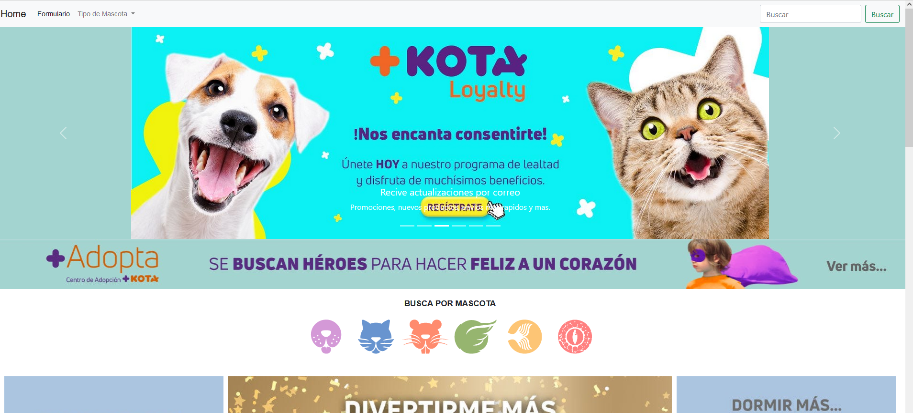

# MASKOTAS
Este repositorio alberga una página web desarrollada con Bootstrap, con el objetivo de recrear una plataforma de venta de artículos para mascotas. Se ha tomado como base una página web existente y se ha trabajado en su mejora y personalización, incorporando diferentes tipos y razas de mascotas. El enfoque principal es brindar una experiencia profesional y atractiva a los usuarios interesados en adquirir productos para sus queridas mascotas.

